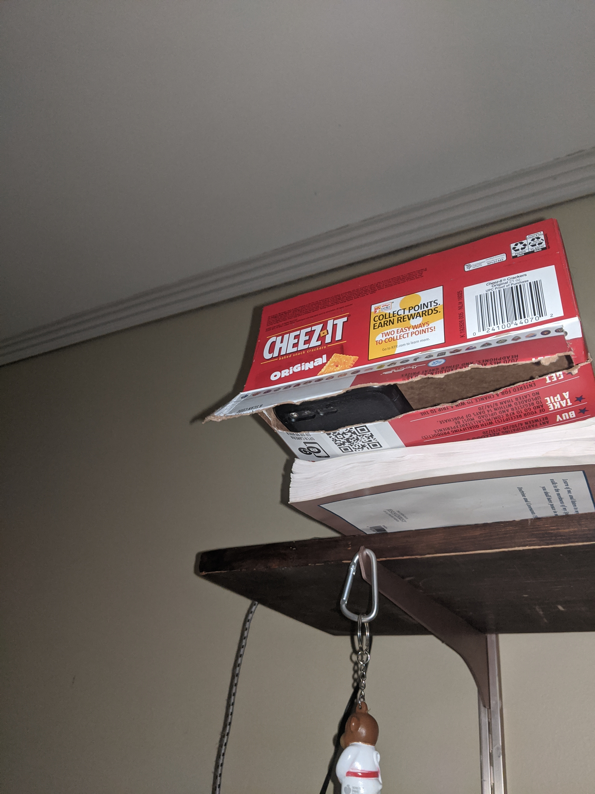

<iframe width="560" height="315" src="https://www.youtube-nocookie.com/embed/live_stream?channel=UCqeIxZ1uYi3vgYZs55KcSPw" frameborder="0" allow="accelerometer; autoplay; encrypted-media; gyroscope; picture-in-picture" allowfullscreen></iframe>

_If the stream above doesn't work, it's because I'm not live. [Subscribe](https://www.youtube.com/user/OfficalThomasHowe?sub_confirmation=1) to get notifications when I am._

With finals week at BYU fast approaching, I'm stuck at my apartment trying to be productive, so I'm trying something new.

I have two old Android phones lying around:
- A rose gold Nexus 6P that has miraculously not started bootlooping
- An original Google Pixel featuring a 3.5mm headphone jack

I first took both phones and installed [IP Webcam](https://play.google.com/store/apps/details?id=com.pas.webcam&hl=en_US).

Then I took an empty Cheez-It box, cut a hole in the bottom, and stuck the Pixel inside of it above my desk:

</img>

  

Classy. I set up the 6P behind me for the premium double angle experience.

Next I started up [OBS](https://obsproject.com/) and created the scene you see in the stream above, using media sources pointing to `https://<ip_addr>:8080/video`.

Finally, it was just a matter of hooking OBS into YouTube for streaming using the provided stream key.

That's everything! If you're struggling to focus in quarantine too, stream [here](https://youtu.be/MyE7Mik0I5A) sometime during winter/spring 2020 and we can study together.

***

Side note: I used [scrcpy](https://github.com/Genymobile/scrcpy) with ADB over TCPIP to do whatever I couldn't with IP Webcam's web interface, like changing the resolution or frame rate.
